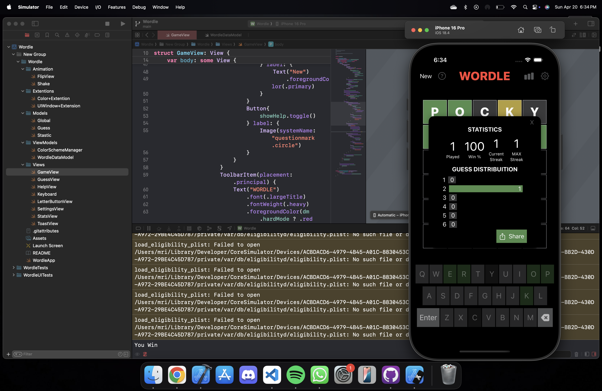

# 🎯 Wordle Clone
A **Wordle** clone built using **Swift & SwiftUI** for educational purposes and SwiftUI practice.


[](https://opensource.org/licenses/Apache-2.0)
[](https://github.com/shameemreza/wordleclone/blob/main/LICENSE)


## 📸 Screenshots
<div>
  
  
  
  
  
  
  
</div>

## ✨ Features

- 🎮 **Hard Mode**
- 🆘 **Help Screen**
- 🌗 **Light and Dark Mode**
- 📤 **Share Results**
- 📊 **View Statistics**

## 📦 Installation

Requires **Xcode 13+** and **iOS 15+**

1. Clone the repository:
   ```bash
   git clone https://github.com/Mridul-Learing-Unisa/Wordle.git

2. open Wordle.xcodeproj
3. Build and run on a simulator or your device.

## 📚 Resources

- [Stewart Lynch – Wordle Guide](https://www.createchsol.com/Wordle)
- [SwiftUI Shake Animation – objc.io](https://www.objc.io/blog/2019/10/01/swiftui-shake-animation/)
- [Card Flip Animation – Samuel Do](https://github.com/SamuelDo02/swiftuitutorials/blob/main/Flashcard.swift)
- [THE DICTIONARY MASTER (Word List)](https://www.angelfire.com/extreme4/safer_sephiroth/EVERY_WORD_EVER.htm)


## ⚖️ License
```text
Copyright 2022 Shameem Reza

Licensed under the Apache License, Version 2.0 (the "License");
you may not use this file except in compliance with the License.
You may obtain a copy of the License at

   http://www.apache.org/licenses/LICENSE-2.0

Unless required by applicable law or agreed to in writing, software
distributed under the License is distributed on an "AS IS" BASIS,
WITHOUT WARRANTIES OR CONDITIONS OF ANY KIND, either express or implied.
See the License for the specific language governing permissions and
limitations under the License.
```
## 💬 Contact Me

📧 Email: mridulchopra23@gmail.com  
💼 LinkedIn: [Mridul Chopra](https://www.linkedin.com/in/mridul-chopra23/)

